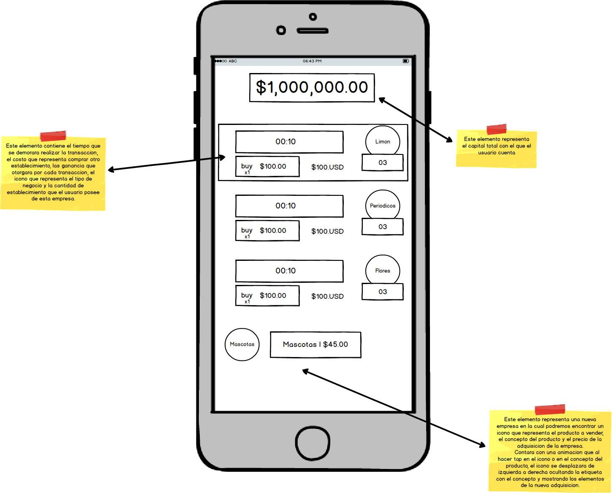

## Capitalism

1.- En el primer elmento (representado en el rectangulo superior) tenemos una cantidad que representa la cantidad actual de dinero que el usuario posee, esta cantidad se puede utilizar para obtener nuevas empresas.
  Dependiendo de la cantidad de dinero que se tenga es el tipo de negocio que el usuario podra adquirir.

2.- En el siguente modulo (el cual, en pantalla hay 3) El primer rectangulo representa el tiempo que demorara la transaccion. El rectangulo que sigue (abajo del tiempo de transaccion) representa la cantidad de empresas que vas a adaquirir y el precio que el usuario pagara por estas. A la derecha de este modulo se ubica el icono que representa que tipo de negocio es, y abajo de este se encuentra la cantidad de negocios de este mismo tipo tiene el usuario.

3.- En el ultimo modulo (parte inferior de la pantalla) representa un nuevo negocio que se va adquirir, dentro de este modulo podremos encontrar un icono en la parte izquierda que representa el tipo de negocio que el usuario va adquirir, y del lado derecho tenemos un submodulo que contienen la descripcion del negocio y el precio este.

